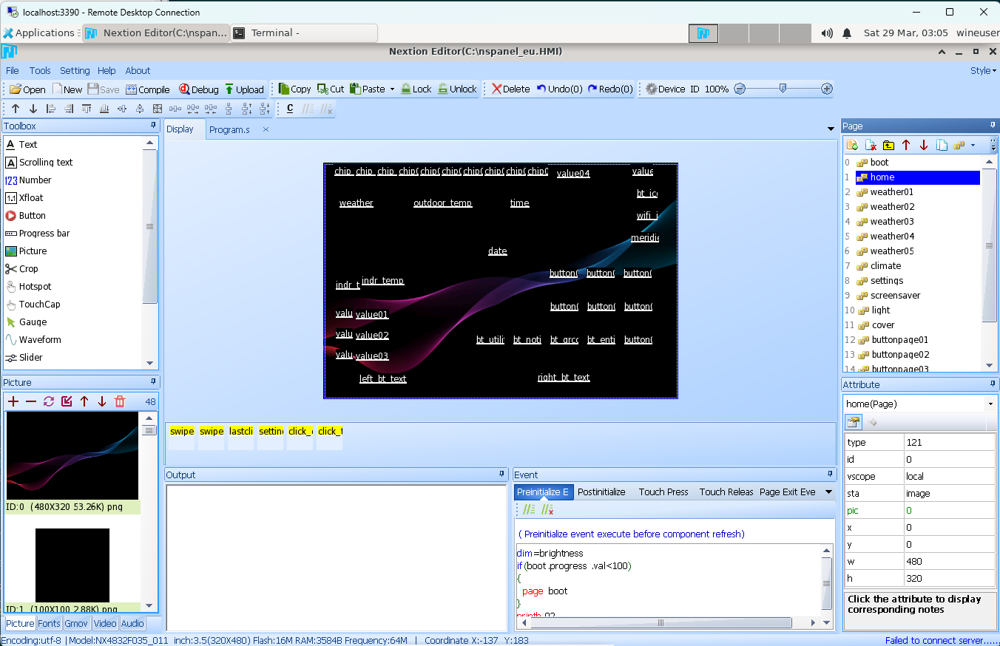

Nextion Editor Docker / Hassio NSPanel Bluperint Background generator
=====================================================================

Nextion Editor running under Wine 10.0 & Docker to allow Nextion TFT files to be built in a more automated way. Also includes AutoHotKey with UIAutomation support to allow Nextion's GUI to be controlled from scripts.

Docker hub link: https://hub.docker.com/r/sztupy/nextion-editor

Hassio Add-on link:

[](https://my.home-assistant.io/redirect/supervisor_add_addon_repository/?repository_url=https%3A%2F%2Fgithub.com%2Fsztupy%2Fnextion-editor-docker)

Please see the [Add-on readme](hassio-nspanel-blueprint-generator/README.md) for more details about the Home Assistant add-on



<div align="center">
  
  
  
</div>

This repository contains the following projects:

* `nextion-editor`: Base docker image containing Nextion Editor and automtion helper scripts
* `nextion-scripts`: Docker image additonally supporting some basic actions to be done in an automated way against HMI files
* `nextion-hassio`: The docker container for the Home Assistant Add-on
* `nextion-hmi2txt`: Nextion2Text from https://github.com/MMMZZZZ/Nextion2Text/tree/master in a container
* `hassio-nspanel-blueprint-generator`: Home Assistant Add-on to help build NSPanel TFT files with different backgrounds locally

## `nextion-editor`

### Build

To build the docker container locally do the following:

```sh
docker/build.sh
```

This will download the following files:

* Nextion Editor
* Windows KB971513 Patch (required to support UIAutomation under Wine 10.0)
* AutoHotKey 1.1
* Pulovers Macro Editor (specifically a bloatware-removed version)
* UIAViewer for AHK

And then build a docker-wine container with the required apps pre-installed at

* `C:\data` (Windows path)
* `/home/wineuser/.wine/drive_c/data` (Linux path)

### Run graphical mode

After the container has been built you can start up Wine in RDP mode using

Linux,BSD,OSX shell / Windows Powershell:

```sh
docker run -it --rm -v ${PWD}:/app/input --hostname="nextion-editor" --env="RDP_SERVER=yes" --publish="3389:3389/tcp" sztupy/nextion-editor:latest
```

Windows CMD:

```sh
docker run -it --rm -v %cd%:/app/input --hostname="nextion-editor" --env="RDP_SERVER=yes" --publish="3389:3389/tcp" sztupy/nextion-editor:latest
```

Once started you can connect to this container via Remote Desktop on `localhost:3389`. Username and password is `wineuser`. Nextion Editor will be available on the Desktop. Files will be available at `Z:\app\input` however please note you will need to copy them over to ``C:\`` for Nextion to be able to access them.

You can also use UIAutomation Viewer to plan your macro if you want to automate what you're doing.

## `nextion-scripts`

The container includes AHK and UIAutomation to automate some common tasks without needing a GUI or any manual intervention. Most scripts will start up Nextion, click around the GUI to do their work, and finally put the resulting files under `/app` so they can then be downloaded from the container. While the scripts generally try to be clever, this is not always possible and might resort to mouse clicks on specific locatons on the screen. Generally all scripts expect Nextion to run under a resolution of 1024x768.

Replace `${PWD}` with `%cd%` if you're using docker from Windows' CMD. Keep the commands as-is on Windows Powershell, and on Linux/BSD/OSX

### Compile / Build TFT files from HMI

The following script will load up a HMI file, then compile and save it as a TFT file.

Name your file `input.hmi` in your current directory

```sh
docker run -it --rm -v ${PWD}:/app/input sztupy/nextion-scripts:latest ./compile.sh
```

Outputs will be `output.hmi` and `output.tft`

### Update the version number in an NSPanel Blueprint HMI file

Name your file `input.hmi` in your current directory

```sh
docker run -it --rm -v ${PWD}:/app/input sztupy/nextion-scripts:latest ./update_version.sh <VERSION_NUMBER>
```

Outputs will be `output.hmi` and `output.tft`

### Batch updating images in a HMI file

The following script will load up a HMI file, remove all images from it, then re-import them from a directory. Once updated it will save the HMI file and compile it as well to TFT. The script will import images `0.png` to `47.png` from this folder (with `32.jpg` as an exception being in JPG format). You would need to update the script `UpdateImages.ahk` if you need to import something else.

Name your file `input.hmi`. Put images you wish to upload to a folder named `pics`. Both should be in the current directory

```sh
docker run -it --rm -v ${PWD}:/app/input sztupy/nextion-scripts:latest ./update_images.sh
```

Outputs will be `output.hmi` and `output.tft`

### Batch updating fonts in a HMI file

The following script will load up a HMI file, then swap all fonts with the ones provied between `0.zi` and `12.zi`. Also updates program.S and replaces `int charset=1` with `int charset=2`

Name your file `input.hmi`. Put images you wish to upload to a folder named `fonts`. Both should be in the current directory

```sh
docker run -it --rm -v ${PWD}:/app/input sztupy/nextion-scripts:latest ./update_fonts.sh
```

Outputs will be `output.hmi` and `output.tft`

### Misc

Other scripts. Can be called with:

```sh
docker run -it --rm -v ${PWD}:/app/input sztupy/nextion-scripts:latest ./run-script.sh <ScriptName.ahk>
```

* `UsLandscapeConvert.ahk`: Converts NSPanel EU version to NSPanel US Landscape version

### Debugging scripts

To debug any of the scripts you can do:

```sh
docker run -it --rm -v ${PWD}:/app/input sztupy/nextion-scripts:latest bash
```

then in the container's shell run:

```sh
./dump_screenshots.sh &
./<original_command.sh>
```

This will create screenshots of what's happening on the screen in your local folder that you can check later.

## `nextion-hassio` / `hassio-nspanel-blueprint-generator`

Install link for the Add-on:

[](https://my.home-assistant.io/redirect/supervisor_add_addon_repository/?repository_url=https%3A%2F%2Fgithub.com%2Fsztupy%2Fnextion-editor-docker)

Please see the [Add-on readme](hassio-nspanel-blueprint-generator/README.md) for more details
